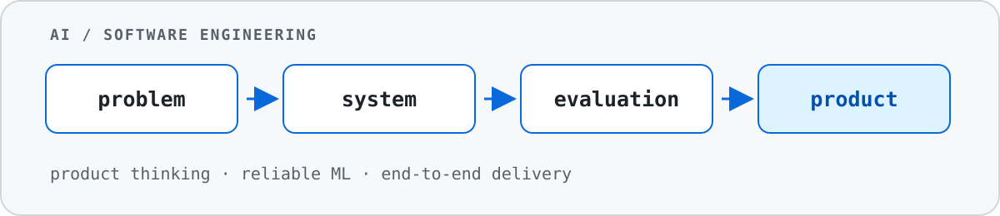

<picture>
  <source
    media="(prefers-color-scheme: dark)"
    srcset="./assets/banner-dark.svg"
  />
  <source
    media="(prefers-color-scheme: light)"
    srcset="./assets/banner-light.svg"
  />
  
</picture>

# Илья Скворцов

**AI / Software Engineer · Product Engineer**

Создаю прикладные AI/ML- и software-продукты. В моих проектах продуктовая
постановка связана с архитектурой, данными, evaluation, API, интерфейсом,
хранением, тестами и поставкой.

Основной интерес — системы, которые экономят время, снижают операционную нагрузку
и дают пользователю проверяемый результат. Часть проектов выросла из моих
собственных задач и прошла проверку в реальном использовании.

## Основные проекты

### [UnitKeeper](https://github.com/ilyascw/UnitKeeperBot)

Telegram Mini App для распределения повторяющихся задач, peer-approval и
прозрачного учёта нагрузки в небольших группах.

- **Проблема:** устные бытовые договорённости быстро теряются; учёт вклада сам
  становится дополнительной работой и источником напряжения.
- **Проверка:** продукт использовали три группы в течение 11, 3 и 2 месяцев.
- **Итерация:** старый Telegram-бот создавал лишнее трение в навигации. Я
  переработал сценарии в Mini App и усилил backend-архитектуру.
- **Мой вклад:** механика спринтов и весов, peer-approval, double-entry ledger,
  transactional outbox, идемпотентность, миграции и CI.

`FastAPI` · `React` · `TypeScript` · `PostgreSQL` · `SQLAlchemy` · `Docker`

### [Local Meal Planner](https://github.com/ilyascw/local-meal-planner)

Локальный планировщик питания, который объединяет домашние рецепты, готовую еду
поставщиков, бюджет, пищевые нормы и доступное время.

- **Проблема:** вечерний выбор еды регулярно расходует время и внимание; доставка
  и случайные быстрые блюда становятся решением по умолчанию.
- **Текущий сценарий:** я использую приложение сам и передаю недельные пожелания
  AI-агенту через CLI. Planning engine проверяет ограничения по локальному
  каталогу.
- **Продуктовая метрика:** время от пожеланий до согласованного плана, доля
  заранее закрытых приёмов пищи и стоимость высвобождённого времени.
- **Мой вклад:** модель данных, planning engine, web UI, HTTP API, CLI,
  agent skill, тесты бизнес-инвариантов и privacy-safe demo.

`Python` · `SQLite` · `Vanilla JS` · `CLI / agent skill` · `Docker`

### [Chest CT Pathology Screening](https://github.com/ilyascw/chest-ct-classification)

Research pipeline для первичного скрининга КТ грудной клетки с помощью CT-CLIP
и CatBoost.

- 1 182 исследования из CT-RATE и открытых наборов MosMedData;
- test ROC AUC — **0,8642**, PR AUC — **0,8833**;
- DICOM/NIfTI preprocessing, 512-мерные embeddings и пакетный XLSX-отчёт;
- FastAPI, CLI, защита обработки архивов и GPU-oriented Docker deployment;
- зафиксированы ограничения patient-level split, внешней валидации и
  медицинского применения.

`CT-CLIP` · `PyTorch` · `CatBoost` · `FastAPI` · `DICOM / NIfTI`

## Другие проекты

| Проект | Результат | Инженерный фокус |
| --- | --- | --- |
| [Early Retirement Risk Model](https://github.com/ilyascw/early-retirement-risk-model) | Ранжирование редкого риск-события под ограниченную ёмкость ручной проверки | PR-AUC, calibration, fairness audit, model card |
| [Local Document Generator](https://github.com/ilyascw/local-document-generator) | Пакетная генерация юридических DOCX из локального desktop-приложения | Rust, Tauri, React, SQLite, E2E |
| [Demand Forecasting](https://github.com/ilyascw/demand_forecasting) | Прогноз 1 782 временных рядов; CatBoost снизил WAPE примерно на 70% относительно mean baseline | Temporal validation, recursive forecast, leakage control |
| [Road Safety Video Analyzer](https://github.com/ilyascw/traffic_violation_checker) | Приоритизация потенциально опасных эпизодов видеорегистратора | OpenCV, YOLO adapter, desktop/CLI, offline eval protocol |
| [Car Color Detector](https://github.com/ilyascw/CarColorDetector) | Автомобиль → маска кузова → палитра доминирующих цветов | YOLOv8, Segment Anything, K-means, FastAPI, Gradio |
| [Travel Budget Dashboard](https://github.com/ilyascw/travel-dashboard) | Бюджет, прогноз расходов и карта продолжительного путешествия | pandas, Streamlit, Plotly, Folium |

## Инженерный подход

- Фиксирую пользовательскую проблему, ограничения и метрики до выбора
  технического решения.
- Разделяю детерминированные бизнес-правила и модельные компоненты.
- Подбираю evaluation под риск задачи: temporal validation, PR-AUC, calibration,
  fairness-срезы, CV-метрики и продуктовые инварианты.
- Использую типизацию, тесты, миграции, Docker и GitHub Actions в проектах,
  где они соответствуют эксплуатационному сценарию.
- Публикую синтетические demo-данные; личные, клиентские и медицинские данные
  остаются за пределами репозиториев.

## Сейчас

- готовлю повторное развёртывание UnitKeeper и usability-тесты с новыми
  семейными группами;
- развиваю agent workflow и модель стоимости времени в Local Meal Planner;
- собираю портфолио AI/ML- и software-проектов с воспроизводимыми результатами.
